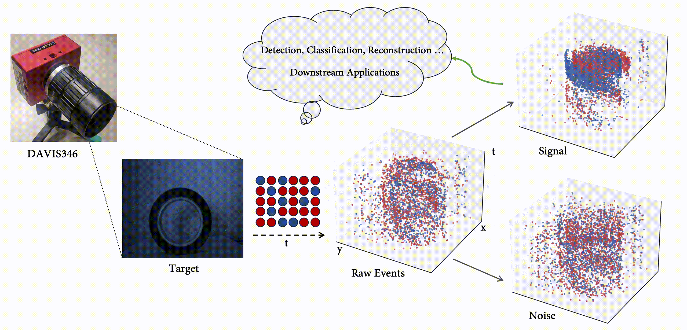

# Overview
This repo provides the code of [Neuromorphic Imaging with Density-Based Spatiotemporal Denoising](https://doi.org/10.1109/TCI.2023.3281202).
```
@article{zhang2023tci,
  title    =  {Neuromorphic Imaging with Density-Based Spatiotemporal Denoising},
  author   =  {Pei Zhang and Zhou Ge and Li Song and Edmund Y. Lam},
  journal  =  {IEEE Transactions on Computational Imaging},
  volume   =  {9},
  pages    =  {530--541},
  month    =  {May},
  year     =  {2023},
  doi      =  {10.1109/TCI.2023.3281202}
}
```

## Sample
Download our [samples](https://connecthkuhk-my.sharepoint.com/:u:/g/personal/u3008016_connect_hku_hk/EU1CVbq4zE5Jozh1YR7ZHNUBrs20l4UEFKVrKiaAWMNVxg?e=O0Ipbw) for verification and further research.

## Implementation
- [x] Code will be released in the near future. Stay tuned for updates!
